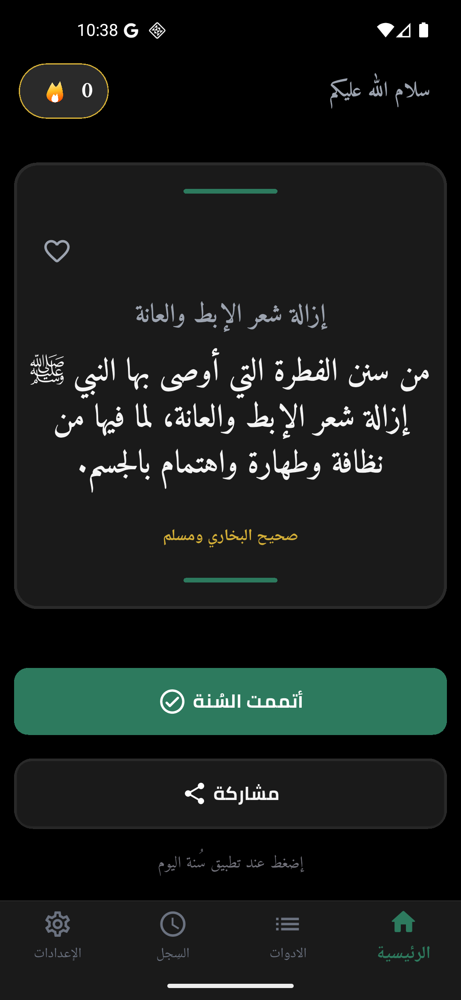
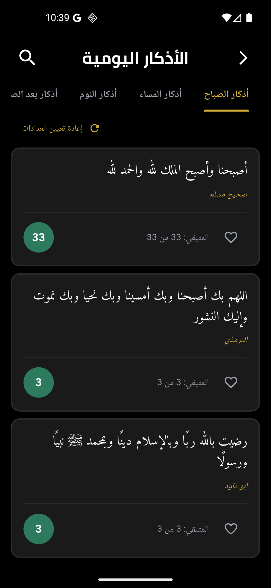
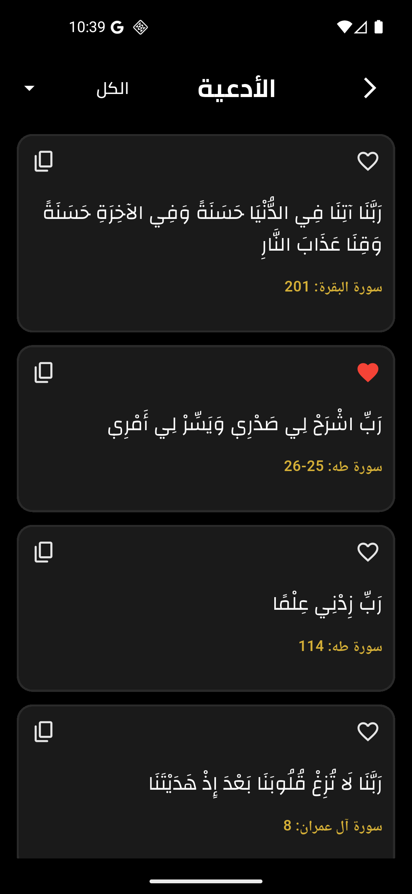
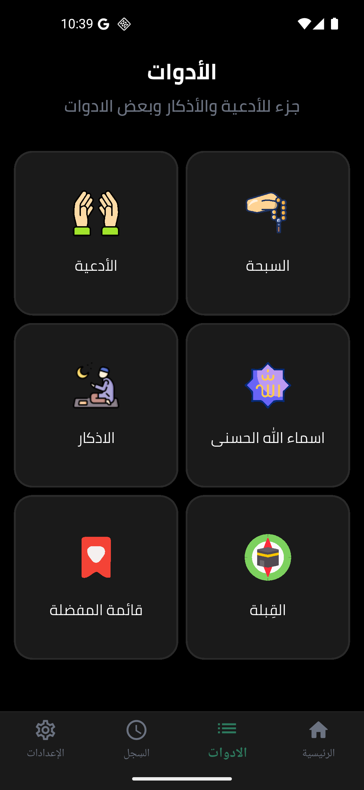

# 📖 قال رسول الله

<div align="center">


### تطبيق إسلامي متكامل للأذكار والأدعية والسنن النبوية


</div>

---

## 🌟 نبذة عن المشروع

**قال رسول الله** هو تطبيق إسلامي حديث يهدف إلى مساعدة المسلمين على المحافظة على الأذكار اليومية والسنن النبوية والأعمال الصالحة من خلال تجربة استخدام عصرية وسلسة.

يجمع التطبيق بين الأذكار والأدعية والسنن النبوية والإشعارات الذكية ونظام الإنجازات والتحفيز لمساعدة المستخدم على بناء عادات إسلامية يومية مستمرة.

---

## 🎯 أهداف المشروع

- نشر السنن النبوية العملية.
- تشجيع المسلمين على المحافظة على الأذكار.
- تذكير المستخدم بالأعمال الصالحة.
- تعزيز الاستمرارية في العبادة.
- تقديم تجربة إسلامية حديثة وسهلة الاستخدام.
- تحفيز المستخدم من خلال النقاط والإنجازات.

---

# ✨ المميزات

## 📿 الأذكار

- أذكار الصباح
- أذكار المساء
- أذكار النوم
- أذكار الاستيقاظ
- أذكار بعد الصلاة
- أذكار متنوعة

## 🤲 الأدعية

- مكتبة كبيرة من الأدعية
- تصنيف الأدعية حسب الفئات
- عرض واضح وسهل للقراءة
- إمكانية التصفح السريع

## 🌙 السنن النبوية

- عرض السنن اليومية
- متابعة السنن المنجزة
- تشجيع المستخدم على تطبيق السنن
- نظام متابعة للتقدم

## 🔔 الإشعارات الذكية

- تذكيرات يومية
- إشعارات للأذكار
- إشعارات للسنن
- رسائل تحفيزية

## 🏆 الإنجازات والأوسمة

- نظام نقاط
- أوسمة وإنجازات
- تتبع التقدم
- نظام الاستمرارية اليومية

## 📊 الإحصائيات

- عدد الأذكار المكتملة
- عدد السنن المنجزة
- إجمالي النقاط
- معدل الالتزام اليومي

## 🎨 تجربة مستخدم مميزة

- تصميم عصري وأنيق
- الوضع الداكن والفاتح
- رسوم متحركة سلسة
- واجهات سهلة الاستخدام

---

# 📱 Screenshots

<div align="center">




<br><br>




</div>

---

# 🏗️ هيكل المشروع

```text
lib/
│
├── core/
│   ├── constants/
│   ├── services/
│   ├── theme/
│   ├── widgets/
│   └── utilities/
│
├── features/
│   ├── home/
│   ├── azkar/
│   ├── dua/
│   ├── sunnah/
│   ├── notifications/
│   ├── achievements/
│   ├── statistics/
│   └── settings/
│
├── data/
├── models/
│
└── main.dart
```

---

# ⚙️ التقنيات المستخدمة

## Frontend

- Flutter
- Dart
- Material Design 3

## State Management

- Provider
- Bloc / Cubit

## Local Storage

- Hive
- SharedPreferences

## Notifications

- Flutter Local Notifications
- Timezone

## UI & Animations

- Google Fonts
- Lottie

---

# 🚀 تشغيل المشروع

## المتطلبات

- Flutter SDK
- Dart SDK
- Android Studio أو VS Code
- Android Emulator أو جهاز حقيقي

## تثبيت المشروع

### 1. استنساخ المستودع

```bash
git clone https://github.com/your-username/qal-rasool-allah.git
```

### 2. الدخول إلى المشروع

```bash
cd qal-rasool-allah
```

### 3. تحميل الحزم

```bash
flutter pub get
```

### 4. تشغيل التطبيق

```bash
flutter run
```

---

# 📦 الحزم الرئيسية

```yaml
flutter_bloc
provider
shared_preferences
flutter_local_notifications
timezone
google_fonts
lottie
hive
hive_flutter
```

---

# 🏆 نظام التحفيز

يحتوي التطبيق على نظام متكامل للتحفيز يساعد المستخدم على الاستمرار في أداء العبادات اليومية من خلال:

- كسب النقاط.
- فتح الإنجازات.
- الحصول على الأوسمة.
- تتبع الاستمرارية اليومية.
- متابعة التقدم الشخصي.

---

# 🔮 التطويرات المستقبلية

- [ ] القرآن الكريم
- [ ] تفسير القرآن
- [ ] مكتبة الأحاديث النبوية
- [ ] سبحة إلكترونية
- [ ] مواقيت الصلاة
- [ ] اتجاه القبلة
- [ ] ختمة القرآن
- [ ] تسجيل الدخول والمزامنة السحابية
- [ ] تحديات إسلامية جماعية
- [ ] مشاركة الإنجازات

---

# 🤝 المساهمة

نرحب بجميع المساهمات والتطويرات.

```bash
git checkout -b feature/NewFeature
git commit -m "Add New Feature"
git push origin feature/NewFeature
```

ثم قم بإنشاء Pull Request.

---

# 👨‍💻 المطور

**Abdullah**

Flutter Developer & AI Enthusiast

---

# 🌙 رسالة

> قال رسول الله ﷺ:
>
> **"أحب الأعمال إلى الله أدومها وإن قل"**

نسأل الله أن يجعل هذا العمل خالصًا لوجهه الكريم وأن ينفع به المسلمين في كل مكان.

---

# ⭐ دعم المشروع

إذا أعجبك المشروع فلا تنسَ وضع ⭐ للمستودع على GitHub.

---

<div align="center">

### جزاكم الله خيرًا 🤲

**Made with Flutter ❤️ for the Muslim Ummah**

</div>
